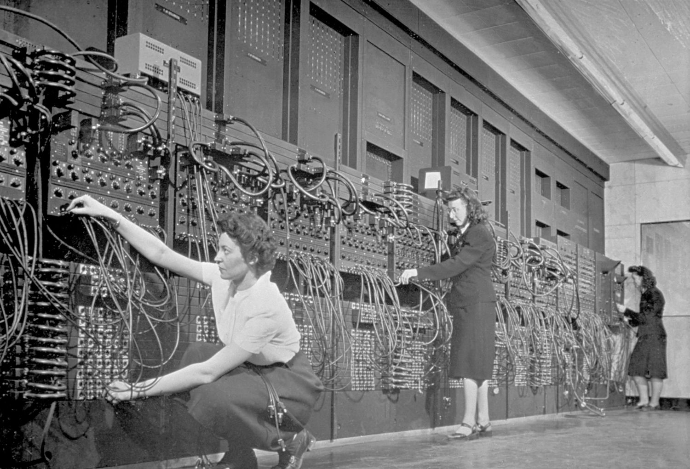
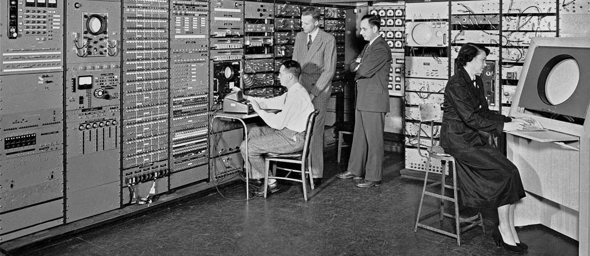
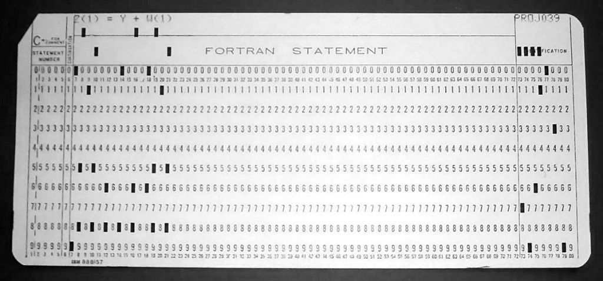

# Aula 1: introdução, conceitos

Vivemos em um mundo mergulhado em tecnologia, no qual a interação com dispositivos de Tecnologia de Informação e Comunicação é questão quase essencial de sobrevivência, ou pelo menos de conforto. Para todo lugar que olhamos, existe uma interface querendo se comunicar conosco, seja um microondas, uma televisão, nosso smartphone, ou até a lanchonete onde comemos.

Basta analisar um dia banal da nossa vida. Entre cama, banho, refeições, trabalho, entretenimento, descanso, com quantos objetos interativos temos que lidar? Ao interagir com meu chuveiro, ainda em um estado entorpecido por mais um noite mal dormida assistindo Netflix, demoro uns cinco minutos pra chegar na temperatura que eu quero!

Podemos avaliar a importância da interfaces pela grandiosidade do que o Smartphone fez pela popularização da computação. Descontados aí os acessos desnecessários, apenas para aplacar a ansiedade e espantar o tédio, percebam quantas vezes, e pra quantos tipos de tarefas, interagimos com o smartphone, através dos gestos com dedos, voz. 

Além disso, imaginemos tantas pessoas que puderam exercer atividades das mais simples e banais, no contexto de uma pandemia - algo que não acontecia desta forma desde o início do Século XX -, através da interação direta com dispositivos e interfaces. Se são amigáveis, não dá pra saber com precisão (até porque a qualidade de ser amigável é algo a se definir), mas que são úteis, não podemos negar. Através das interfaces é que o mundo tem funcionado desde 2020.

Transformações profundas como essas foram possibilitadas porque projetistas de interface com o usuário domaram a tecnologia para que ela servisse às necessidades dos seres humanos. Falamos aqui de uma ciência chamada de Interação Humano-Computador, que aplica métodos de psicologia experimental às ferramentas poderosas da computação, integrando lições de psicólogas educacionais e industriais, designers de produto/gráficos, escritores, especialistas em ergonomia, até antropólogos e sociólogas.

Em meados da década de 80, foi cunhado o termo **Interação Humano-Computador** (de agora em diante IHC) para definir esta nova área de estudo, cujo foco não era apenas o projeto de interface, mas todos os aspectos relacionados com a interação entre usuários e sistemas. Em determinado momento da história chegou-se à conclusão que a Interação é um termo mais amplo do que a Interface. Imagine um grande conjunto chamado interação que, para existir, necessita de um elemento que permita a comunicação – a interface. O resultado disso é que, entendendo a interação, será mais fácil projetar a interface.

## Por que Estudar IHC

As figuras acima ilustram como os computadores eram programados e utilizados pelos programadores e operadores na década de 50. Na verdade, **programadoras**, pois esse era um trabalho essencialmente de mulheres. Elas estavam literalmente dentro da máquina, pois esta ocupava grandes salas inteiras.  Vou usar como exemplo o ENIAC, conhecido como primeiro computador totalmente digital de propósito geral que era *turing-completo*. Ele não era um computador de programas armazenados, como conhecemos hoje; na verdade era uma coleção de máquinas de somar eletrônicas controladas por uma teia de cabos elétricos. A máquina era programada por ligações desses cabos em diferentes placas, representadas por tabelas de funções numéricas. A programadora plugava cabos e configurava 1.200 interruptores de 10 posições cada para cada tabela de funções. Internamente, tudo isso era acionado por 18.000 válvulas, que implementavam as portas lógicas -- uma por dia era taxa de queima dessas válvulas. Só assim usuários poderiam calcular resultados de equações diferenciais, por exemplo. 

Vamos pular pra frente no tempo, pra um computador padrão na década de 70, uma super evolução em termos de poder computacional e confiabilidade, antes que esses computadores centrais pudessem ser acessados em terminais “burros“. (Mainframes são tão confiáveis que muitas corporações não os trocam por servidores mais modernos, até hoje, 2022.) Em universidade e grande empresas, os computadores só podiam ser operados por determinados funcionários; ou seja, eles eram a interface humano-computador, as pessoas. 

 Ainda estamos dentro da ideia de que o usuário também é o programador da máquina, mas não interage com ele. Ele cria o programa através de cartões perfurados (imagem acima). **Cada cartão é uma linha do programa**. No exemplo acima, a linha Z(1) = Y + W(1), numa linguagem chamada FORTRAN, era perfurada desta forma. Notem que existem nove linhas, 1 to 9, uma linha 0, e duas linhas não-marcadas acima, embaixo das variáveis. Cada caractere do comando era codificado usando de zero a 3 furos no cartão, em que 0 representa um espaço. Por exemplo, Z é codificado como dois furos, em 0 e 9. Usando a tabela abaixo, podemos ver que a intersecção entre 0 e 9 é Z. O valor 1 é apenas um furo em 1. Já o sinal de + é codificado como um furo em Y, outro em 6 e outro em 8.

(fonte: https://craftofcoding.wordpress.com/2017/01/28/read-your-own-punch-cards/ )

Isso era o que você tinha que saber ler para criar e manter um programa no computador. Um horror, né? Sem contar com o fato de que usar um programa exigia que você ou alguém teria que escrever o programa antes -  não existia um mercado de compra de software; o software que vinha com a máquina era o sistema operacional, nada mais. O conceito de aplicativo, destinado a usuários, veio só alguns anos depois.

Bom, a ideia é que você, se quisesse usar o computador, teria que escrever um programa, numa **perfuradora de cartão**, na sua sala. Você então levaria a pilha ordenada de cartões perfurados (um deck) para o operador do computador, num setor chamado CPD. O operador levaria o programa para ser lido e executado pelo computador. Horas depois, ou talvez no dia seguinte, você voltaria para verificar o resultado da sua computação, que podia ser o esperado, ou uma mensagem de erro apenas!

Comparemos isso tudo com  como programamos hoje, com Python e outras linguagens de alto nível, vendo diretamente em monitores coloridos em alta definição, um ambiente em que testamos e depuramos nossos programas, em tempo real. Ou pensemos nos usuários de aplicativos de smartphone hoje, que diferença absurda!

A disciplina de IHC propõe-se a refletir sobre sua importância no desenvolvimento e uso da computação por todos esses anos — ajudando a entender como o foco nas máquinas foi se deslocando para os humanos, levando em consideração suas limitações e sua excelência. Em termos mais práticos, você pode se perguntar: "Por que estudar isso, se nas empresas que trabalho existem equipes que cuidam apenas de IHC?" Embora considere um questionamento oportuno, acho que há alguns bons motivos para se dedicar uma disciplina para isso no curso de Ciência da Computação:"

* Primeiro, se você trabalhar em equipes multidisciplinares, uma noção, mesmo que básica, sobre o trabalho de outra equipe auxilia a *comunicação*;
* Segundo, mesmo em equipes multidisciplinares, desenvolvedores de software ainda tomam muitas micro-decisões de interação;
* Claro que ainda existem muitas organizações que não possuem equipes multidisciplinares;
* Muita gente em computação pode estudar e pesquisar na área, do ponto de vista da tecnologia envolvida na interação.

## Conceitos básicos

A interface é responsável por promover estímulos de interação para que o usuário obtenha respostas relacionadas às suas atividades. De um lado ela funciona como dispositivo de entrada de dados e, de outro, ela é responsável por enviar as respostas aos usuários, ou seja, o estímulo promovido fará com que o usuário desenvolva um processo de interação que significa a execução de ações para a realização das tarefas. Para cada ação uma nova resposta é esperada por ambos os lados: sistema e usuário.

**INTERFACE**: Termo pioneiro que estabelece o conceito de ponto de interação entre um computador e outra entidade.

**INTERAÇÃO**: Enfoque mais amplo com novos campos de estudo envolvendo a comunicação entre usuários e computadores ou outros tipos de produtos.

Designers de UI  vão fazer com que essa experiência da pessoa com uma interface seja agradável, onde tudo esteja alinhado e ele reconheça o que ele está fazendo. Então, a interface tem que ser fácil de ser manuseada. No final do dia, o designer de UI deve pensar três pontos, principalmente: utilidade, na usabilidade e na desejabilidade. Ele deve assegurar que a interface entre o humano e a máquina favoreca a execução das tarefas, seja agradável e crie uma conexão emocional com o produto. 

**UX é User Experience**, experiência de usuário, um termo moderno usado para expressar a relação de uma pessoa com produto, serviço ou aplicativo, e inclui todos os elementos que interferem na experiência de um usuário com o produto. Termo cunhado por Don Norman, um dos principais gurus da IHC na indústria. Na década de 90, quando ainda trabalhava na Apple, Norman acreditava que as definições que existiam, naquela época, como interface do usuário e usabilidade, limitavam o entendimento sobre o trabalho que ele fazia.

O papel do projetista de UX é pensar nas interações que o usuário vai ter com o produto. Vamos pensar num exemplo. Imagina que eu quero comprar um smartphone, iPhone no caso. Então, eu tenho esse desejo de comprar um celular, eu vou até a loja, no caso a loja da Apple. Eu posso ir lá experimentar os produtos, os celulares, os diferentes modelos; eu posso pesquisar o preço, aí eu, efetivamente, compro o produto, eu vou para casa, eu abro o produto da caixa, eu vou mexer no produto, depois eu vou comentar com os meus amigos a experiência que eu tive. Todas essas interações que eu realizei fazem parte da UX da compra de um smartphone. Como vocês viram, o UX designer deve pensar todos esses pontos de contato entre o usuário e o produto, ou serviço. Então, para isso é fundamental que esse profissional conheça muito bem com quem ele está falando, o usuário.

Além das necessidades do usuário, o UX designer tem que ter mente também que não importa você fazer produto para pessoas se não é sustentável para o negócio. Então, o trabalho do UX designer, às vezes, é tentar achar o meio, ou *sweet spot*, o ponto de encontro entre as necessidades do usuário e as necessidades do negócio.

Vamos imaginar uma refeição. A UI da refeição vai ser a apresentação do prato, então como o prato está servido, como os alimentos estão ali, a comida parece apetitosa, é fácil de pegar comida com outros talheres, você consegue servir no seu prato. Já o UX vai depender de outros fatores, que é, por exemplo: Eu cheguei fácil no restaurante Como que está sendo a minha estadia nesse restaurante? Tem uma música ambiente? Eu fui bem tratado O gosto do prato foi bom? Então, são outras coisas.

