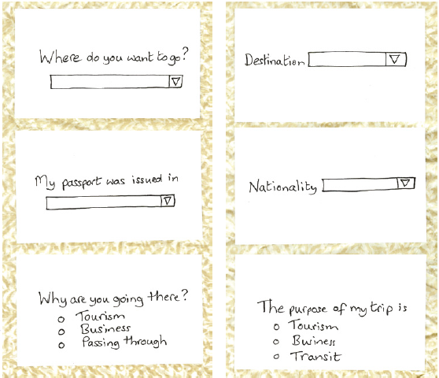
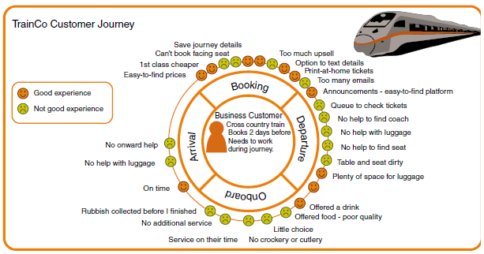
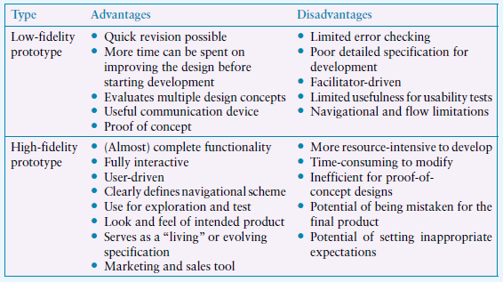
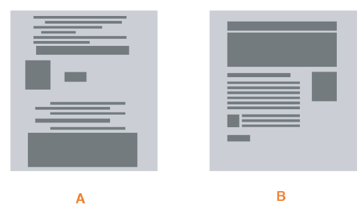
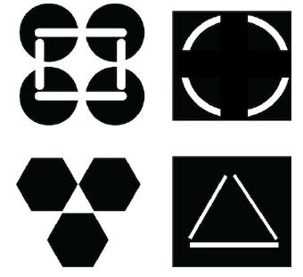
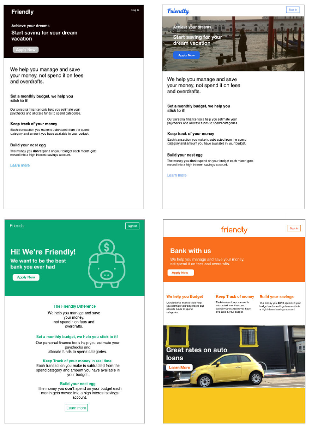
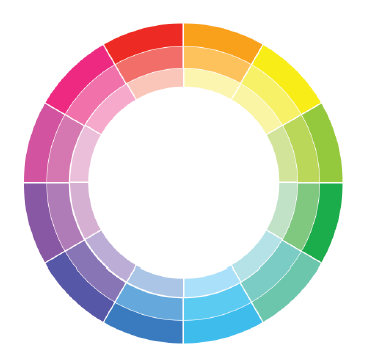

## Slides

[Aula 1]()

[Aula 2]()

## Projeto: entrega

[Protótipo de baixa fidelidade](https://tiagomassoni.github.io/ihc-texts/modulo3/projeto31.html)

[Protótipo de alta fidelidade](https://tiagomassoni.github.io/ihc-texts/modulo3/projeto32.html)

## Prototipação

Protótipos são poderosas ferramentas de design, que incentivam a visão e manipulação de representações da UI, úteis tanto para os **usuários entenderem o que precisam** como para os **designers saberem o que projetar**. Com os protótipos, uma equipe de design pode imaginar cenários específicos, testando-os.

Normalmente, protótipos são limitados, já que enfatizam um conjunto de características específico. Ah, também pode vir em *muitas formas*; não dá pra simplesmente dizer qual o melhor tipo de protótipo para cada ocasião. Em geral, o *custo* de criar o protótipo é que define qual tipo usar. Podemos ter protótipos em folhas de papel, ou pedaços de papelão pintados; talvez uma coleção de componentes de metal com cabos e fios à mostra; ou até uma simulação em software, interativa. 

Protótipos servem para **discutir e avaliar ideias**; são considerados, em essência, uma ferramenta de comunicação, entre designers e usuários, ou entre membros de times. A simples construção de um protótipo encoraja reflexão, sendo uma ferramenta imprescindível em qualquer processo de design. Os protótipos respondem perguntas, testam a viabilidade de certas ideias, e define se essas ideias estão em sintonia com o restante do design. 

## Protótipos de baixa fidelidade (Low-Fidelity)

Não se parece muito com um produto final. De fato, não serve para prover a funcionalidade completa. A ideia é usar materiais mais baratos, mais fáceis de manipular - papel ou papelão, por exemplo.

Esses protótipos são úteis pois tendem a ser simples, baratos e de fácil produção. O que significa que também são rapidamente modificáveis; isso é bem importante nos estágios iniciais de um projeto, já que protótipos são úteis para explorar ideias. Certamente não serão parte do produto final, por isso descartáveis.

Os mais comuns tipos de protótipo *low-fi* são os storyboards(um representação gráfica dos cenários, que discutimos no módulo anterior) e aqueles baseados em papel/cartões.

Os protótipos baseados em papel ou cartões são bem usados para capturar e explorar elementos de uma interação, principalmente trocas entre usuário e produto. É bom porque os elementos de interação (menus, botões, etc.) propostos podem ser manipulados e movidos para simular o ação com o usuários pessoalmente, em uma experiência fim-a-fim. 

O exemplo abaixo mostra, para um aplicativo de organização de viagens de turismo, o processo que envolve requisitos de visto para um determinado país destino.  Cada cartão subentende que haverá um componente de interação que exige uma resposta do usuário ou uma saída do sistema (ou seja, o tal do diálogo). 

A primeira coluna indica uma opção inicial, e a segunda, à direita, indica como ficou depois de considerações da equipe de design e dos usuários que "testaram" a primeira proposta.  Cenários alternativos podem também ser explorados; por exemplo, cartões que envolvam mensagens de erro. 

Os cartões podem ser mostrados para usuários em potencial ou outros membros da equipe de projeto, para que seja coletado feedback. Neste exemplo, durante a discussão sobre essa primeira proposta, poderíamos chegar à conclusão que seria melhor basear a interação em um mapa mundi interativo, onde usuários indicariam seu destino e sua nacionalidade. Outra possibilidade levantada: um painel de bandeiras. Essas alternativas poderiam ser então prototipadas em um novo conjunto de cartões, coletando mais feedback. 

Um conjunto de protótipos em cartões, estabelecendo cenários de uso do software, deve então servir como base para protótipos mais detalhados, tais como rascunhos de tela. Além disso, artefatos mais formais podem ser produzidos, como é o caso do mapa de jornada de usuário (user journey map), exemplificado na figura abaixo.

## Protótipos de alta fidelidade (High-Fidelity)

Esse tipo de protótipo tem muito mais a cara de produto final, normalmente oferecendo alguma funcionalidade adicional. Por exemplo, um protótipo de um módulo de um sistema web já desenvolvido em Javascript, interativo e acessível em um endereço web válido. 

Há um espectro amplo entre baixa e alta fidelidade em protótipos. É comum que eles evoluam em vários estágios de fidelidade durante o projeto, em ciclos projetar-avaliar-reprojetar. 

Um dos potenciais problemas com protótipos de alta fidelidade é que o resultado  parece para o usuário como algo muito próximo do final, o que pode levar a uma limitação no feedback.

A figura abaixo sumariza potenciais vantagens e desvantagens dos níveis de fidelidade dos protótipos.

Um nível intermediário entre baixa e alta fidelidade é o que normalmente é chamado de **wireframe**, oferecendo, usando ferramentas de design, um rascunho geral de elementos padronizados (botões, menus e rótulos), com alguma indicação de navegação. Em muitos projetos de software, este é considerado o último estágio de prototipação. 

## Ferramentas de prototipação

Muitas ferramentas digitais são usadas na prática por equipes de design, principalmente durante a prototipação, em variados níveis de fidelidade. Muitas vezes, até protótipos de baixa fidelidade são produzidos em ferramentas interativas, para que haja uma interação mais precisa - apesar disso, muita gente prefere a interação em grupo provocada pelos protótipos baseados em papel. 

Ferramentas comerciais que dão suporte para a criação de wireframes ou mock-ups são muitas. Apenas algumas:
* Sketch (https://www.sketch.com/)
* Figma (https://www.figma.com/)
* Adobe XD (https://www.adobe.com/products/xd/)

Uma lista mais completa pode ser encontrada aqui: https://www.uxdesigninstitute.com/blog/best-prototyping-tools-for-ux-designers/

No Figma, por exemplo, é bem simples transformar imagens estáticos em protótipos interativos, sem exigência de conhecimento em programação. Os elementos de UI são conectados através da seleção de interaçoes e animações; o resultado pode ser "executado" em um aplicativo do próprio Figma ou em um navegador web.

## Padrões de Projeto de UI

Os padrões de UI são as formas mais comuns como pensar e se comportar ao se relacionar com interfaces de software. Mesmo que cada indivíduo seja único, pessoas em geral se comportam de forma previsível. Designers estudam visitas em sites e usuários por anos; cientistas cognitivos e outros pesquisadores passam muito tempo tentando entender as pessoas. Os princípios e os padrões são resultado de todo esse conhecimento.

Muitos padrões de UI para layout podem ser encontrados em catálogos ou sites ([http://ui-patterns.com](http://ui-patterns.com)). Usaremos aqui como referência o seguinte livro texto: 

**Designing Interfaces: Patterns for Effective Interaction Design**. 
Jenifer Tidwell et al. Terceira Edição. 
O'Reilly.
Link: [https://www.oreilly.com/library/view/designing-interfaces-3rd/9781492051954/]

###  Organização de Conteúdo 

Desses padrões, é importante refletir sobre a estrutura geral da informação no sistema interativo. Há aplicações que se encaixam melhor como um trio barra de busca-lista de navegação-elemento central; já outras funcionam bem como um _player_ de mídia, enquanto algumas se dão muito bem com uma estrutura de _feed_ de conteúdo. 

Essa organização deve servir como metáfora para um atendimento ao cliente humano. Um sistema interativo deve funcionar como tal, dado que não existe um atendimento humano. Assim, o sistema:
* antecipa o que o usuário precisa;
* organiza as informações do ponto de vista do usuário;
* oferece informações claras de forma simples;
* usa palavras que o usuário entende;
* mostra claramente o que fazer a seguir;
* faz com que o status da ação seja realmente óbvio;
* confirma que uma tarefa teve sucesso;

Os padrões de **arquitetura da informação** organizam e rotulam o espaço de informação, para entendimento e uso ótimos. Eles organizam o conteúdo, ajudam a navegar, comunicam claramente e ajudam nas tarefas. Conteúdo detalhado sobre esses padrões em livro texto nas páginas 27 a 128.

* Feature, Search, and Browse
* Mobile Direct Access
* Streams and Feeds 
* Media Browser
* Dashboard
* Canvas Plus Palette Wizard
* Settings Editor 
* Alternative Views 
* Many Workspaces 
* Help Systems
* Tags

### Navegação

Padrões de navegação lidam com o desafio de deixar claro à usuário em que local do sistema ela se encontra, mostrando como sair de um local e chegar em outro. Parece fácil, não é? Na verdade, tarefa gigantesca para designers.

O melhor sistema de navegação é aquele que não é percebido. Deixar o que é importante sempre à mão, tirando do foco aquilo que é menos importante, mantendo uma distância curta para chegar a qualquer lugar. 

Nesse ponto, alguns conceitos. _Signposts_ são elementos que ajudam os usuários a ter noção de seu ambiente. Coisas como título de página e janela, logos, abas, e indicações de seleção, além de indicadores de progresso, _breadcrumbs_, e barras de rolagem. O pessoal de UX usa também o termo _Wayfinding_ para indicar a ação da usuária em encontrar algo; para facilitar tal processo, esperamos do sistema algumas qualidades:
* Boa sinalização;
* Indicações claras, padronizadas;
* Mapas.

Os padrões de navegação tentam promover certas boas práticas gerais. Vamos a elas:
* Separar o projeto de navegação do projeto visual: priorize a forma da usuária navegar, depois disso pense na estética, respeitando as decisões iniciais;
* Carga Cognitiva: Novas páginas adicionam carga cognitiva, a tal "mudança de contexto". As decisões que a usuária deve tomar em cada uma precisam ser padronizadas.

Os padrões de **navegação** versam sobre vários aspectos de navegação: estrutura geral, determinação do status, determinação de onde ir, e formas de chegar lá eficientemente. No material a ser postado no Discord, esses são os padrões incluídos (páginas 129 a 208).

* Clear Entry Points 
* Menu Page
* Pyramid
* Modal Panel
* Deep Links
* Escape Hatch
* Fat Menus
* Sitemap Footer * Sign-In Tools
* Progress Indicator
* Breadcrumbs
* Annotated Scroll Bar

### Layout

Layout? O jeito como os elementos (componentes) estão dispostos. Cada elemento pode ser *informacional, funcional, de enquadramento ou decorativo*. A disposição desses elementos ajuda a guiar e informar usuários sobre a importância relativa de informação e funções. 
Normalmente ouvimos falar do termo interface *limpa*. Um layout limpo segue princípios de hierarquia da informação visual, fluxo visual, alinhamento, além de seguir princípios *Gestalt*. 

O conteúdo mais importante deve se destacar mais, e o menos importante deve ficar menos proeminente. Uma boa hierarquia visual nos fornece, instantaneamente:
* a importância relativa dos elementos de tela;
* os relacionamentos entre eles;
* o que fazer em seguida.

Na figura abaixo, é possível perceber qual informação é mais importante, nas duas telas? A maioria das pessoas acha o exemplo B mais fácil de entender, já que os elementos, o tamanho relativo e a proporção entre eles implica sua importância e guia o leitor ao que realmente importa. Em B, podemos dizer que há uma *hierarquia visual* ausente em A.

O que faz os elementos tornarem-se importantes?
* Tamanho
* Posição
* Densidade: quanto mais denso, melhor para ler, em geral
* Cores de fundo
* Ritmo: espaços entre elementos, grades de elementos
* Alinhamento

### Princípios Gestalt

*Gestalt* é o alemão para "forma", conceito esse da teoria psicológica dos anos 1920s; traz regras que descrevem como humanos percebem objetos visuais. Isso tudo ajuda a definir propriedades de layout que acabam sendo naturais em sistemas visuais.

**Proximidade.** Quando objetos são colocados juntos, quem os visualiza associa um com outro. Por isso elementos relacionados devem ser agrupados visualmente.

**Similaridade.** Itens similares em tamanho, formato ou cor são percebidos com relacionados. 

**Continuidade.** Nossos olhos naturalmente seguem as linhas percebidos e as curvas formadas pelo alinhamento de outros elementos.

**Fechamento (Closure).** Nosso cérebro naturalmente "fecha" linhas para criar formas simples fechadas, mesmo se essas linhas não forem explicitamente fechadas. Exemplos abaixo:

Esses princípios são normalmente usados em combinação. Continuidade e fechamento juntos justificam o alinhamento de elementos, por exemplo.

Os padrões de design para layout definem modos específicos para dispor os componentes na interface. Eles articulam a hierarquia visual de páginas ou telas inteiras (Páginas 209 a 254). 
* Visual Framework 
* Center Stage
* Grid of Equals
* Module Tabs
* Accordion
* Collapsible Panels
* Movable Panels

### Estilo Visual e Estética

Design visual (*look-and-feel*) pode fazer um produto digital se destacar. A linguagem visual usada simboliza uma mensagem que acaba sendo importante para a usabilidade do produto. *Looking good matters*.
A mais pura beleza digital é a combinação da forma física com a função desejada, funcionando juntos, em harmonia. No design de software, não é suficiente que cada pixel seja perfeito, pois deve combinar com utilidade, compreensão e prazer de uso.

O que faz um bom design visual? Em geral é um conjunto de propriedades: composição, cores, tipografia, legibilidade, evocação de sensações, e imagens. 
Por exemplo, a figura abaixo traz telas que  evocam sensações diferentes, ainda que contenham os mesmos elementos visuais. 

Há uma quantidade enorme de padrões relacionados a cada propriedade de design visual. Só para cores, já existe um corpo razoável de conhecimento que pode ser aplicado ao design.
Por exemplo, sugere-se sempre colocar cores frontais escuras sobre cores de fundo claras, e vice-versa (designers testam isso visualizando como escala de cinza em ferramentas como Photoshop). Ou ainda, quando verde ou vermelho indicam alguma distinção, é bom reforçar essa distinção com alguma forma diferente ou texto - cerca de 10% dos homens e 1% das mulheres apresentam alguma forma de daltonismo.

Adicionalmente, é bom evitar algumas combinações de cor. Por exemplo, texto azul brilhante num fundo vermelho cansa os olhos, pois são cores *complementares*, estando localizadas em lados opostos na chamada roda das cores (abaixo).

Quando estamos falando de computadores, tablets ou smartphones, o fundo escuro tem sido uma opção disseminada, para poupar visão e até energia. Outras questões relacionadas a cores: Cores quentes ou frias, contraste baixo (mais relaxante) ou alto (maior tensão/força), muito ou pouco saturado.

Para criar designs visualmente atraentes, é importante compreender os princípios de _teoria das cores, tipografia, layout e hierarquia visual_. A teoria das cores nos ajuda a escolher combinações de cores que transmitam a mensagem certa e evocam as emoções desejadas. Por exemplo, para um aplicativo de saúde e bem-estar, cores calmas e naturais podem ser mais adequadas do que cores vibrantes e intensas. A tipografia também é crucial: escolher fontes legíveis e que se alinhem à identidade do aplicativo é essencial para uma boa legibilidade.

Além disso, a disposição dos elementos na interface é fundamental para criar uma experiência coerente. A hierarquia visual nos ajuda a guiar os olhos do usuário, destacando informações importantes e organizando o conteúdo de forma lógica. Por exemplo, um aplicativo de notícias pode usar tamanhos maiores de fonte e cores vivas para manchetes, enquanto o texto do corpo utiliza uma fonte mais simples.

Os padrões relacionados a estilo visual e estética versam sobre vários princípios de bom design, entre eles: hierarquia visual, cores, tipografia, legibilidade, sentimento e imagens (Material nas páginas 255 a 294). 

### Recebendo Entrada

Já tem uns 30 anos que usamos formulários para entrada de dados em sistemas de informação, e isso é um bom motivo para acharmos que não há muito o que fazer nessa seara, em termos de design. Somos meio que direcionados pelos frameworks de *front-end* a usar seus elementos "de prateleira". 

Ainda assim, muitas dúvidas aparecem, e podem fazer diferença na usabilidade. Considere um simples formulário para cadastrar um endereço. Falhas de design podem arruinar a experiência do usuário: quais campos são obrigatórios? Devo começar pelo CEP? Abreviações são ok? E se eu escrever em outro idioma? Existe um mapa para eu escolher? Por que o sistema não lembra do endereço que eu cadastrei aqui mês passado?

Alguns princípios no design de formulários (mais detalhes nas páginas 471 a 532):
* Fazer formulários simples e curtos, percebendo o tempo que será gasto neles;
* Minimizar quantidade de elementos de entrada: por exemplo, precisa mesmo selecionar a bandeira, já que os dois primeiros inteiros identifica a operadora do cartão;
* Minimizar elementos visuais não-essenciais;
* Agrupar e colocar título em seções de elementos de formulário quando for possível e apropriado;
* Usar alinhamento para o fluxo vertical da visão;
* Indicar claramente obrigatórios e opcionais
* Aceitar variações no formato, como no caso de datas e endereços.
* Prevenção de erros e validação o mais rápido possível na interação.

